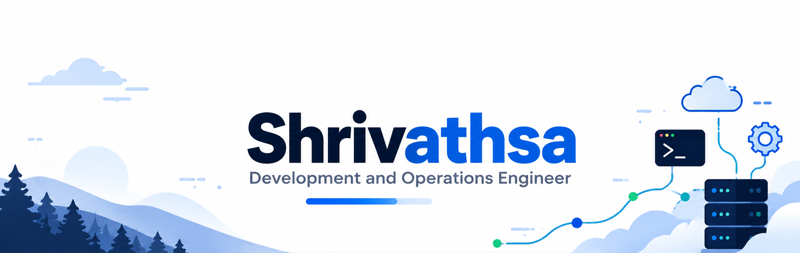

# Hi, I'm Shrivathsa

I work in DevOps, mostly around cloud infrastructure and CI/CD pipelines. Docker, Terraform, and GitLab CI are where I spend most of my time, with AWS and Azure as home base. This profile's a bit sparse for now, still figuring out what's worth sharing here versus just doing quietly at work.

---

## 💼 What I'm Working On
- Automating multi-cloud infrastructure with **Terraform** and **GitLab CI/CD**
- Container orchestration with **Docker** and **Kubernetes**
- Optimizing CI/CD pipelines using **GitLab CI**, and **GitHub Actions**
- Monitoring with **Prometheus**, **Grafana**, **Signoz**, **Sentry** and sometimes **datadog**
- Migrating project tracking from **Jira** to **GitLab**, cleaning up team workflows along the way
- Building and running containerized services on **AWS ECS Fargate**
- Working across a mixed stack - **Go**, **Node.js/TypeScript**, **React** - day to day
- Keeping infrastructure consistent across dev/staging/prod environments with **Terraform**

## 📘 Currently Learning
-  **Kubernetes concepts** & GitOps workflows
-  IaC best practices for **multi-cloud** deployments
-  Using **Terraform modules** and remote backends effectively
-  **MLOps** fundamentals
-  Working with **LLMs**

---

## 🔗 Connect With Me

---

## Tech Stack

### Languages & Scripting

### DevOps & IaC

### Cloud & Monitoring

### Version Control & Collaboration

---

## Certifications

